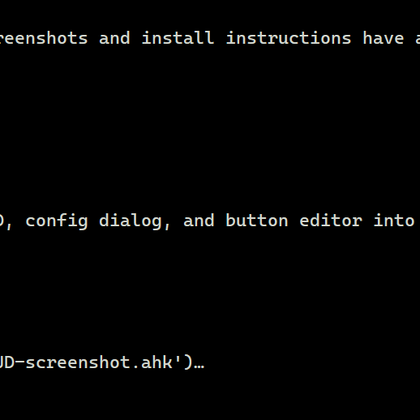
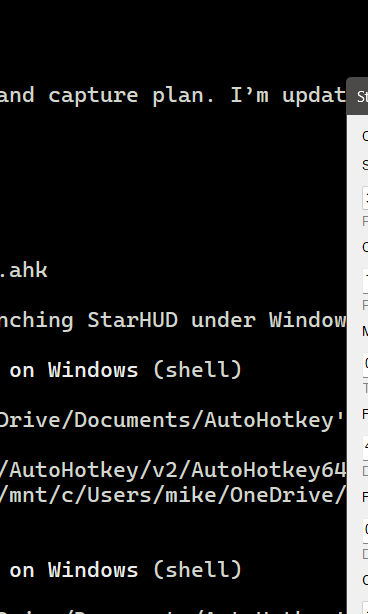
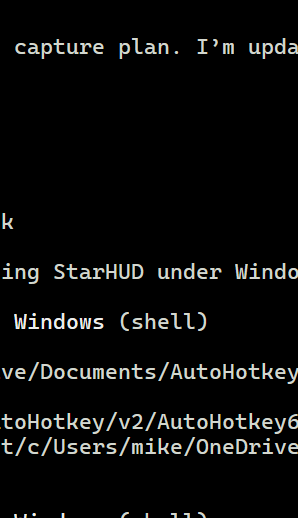

# StarHUD

StarHUD is an AutoHotkey v2 overlay for Star Citizen that opens a configurable 5x5 HUD of mouse-friendly buttons for common ship actions, shortcuts, and macros.

See [INSTALL.md](INSTALL.md) for setup, file placement, and shortcut creation instructions.

## Screenshots

## Features

- Config-driven multi-page button layout
- Automatic shortcut labels generated from the configured action
- Screen-size profiles with optional auto-detection
- Popup positioning modes: `mouse`, `auto-split`, `always-left`, and `always-right`
- Optional mouse input capture while the HUD is open
- In-app layout edit mode with swap, button edit, copy, paste, and delete
- In-app config dialog for size, colors, popup mode, and page management

## Requirements

- Windows
- [AutoHotkey v2](https://www.autohotkey.com/)

## Files

- `StarHUD.ahk` - main runtime script
- `StarHUD-config.ahk` - user-editable settings, pages, and button definitions
- `star-citizen-logo-bright.png` - default center button image
- `StarHUD-center-logo.png` - alternate logo image included with the project
- `StarHUD-center-logo.ico` - icon file for Windows shortcuts

## Getting started

1. Install AutoHotkey v2.
2. Download or clone this repository.
3. Edit `StarHUD-config.ahk` to match your preferred size profile, colors, popup mode, and button bindings.
4. Run `StarHUD.ahk`.

## Default controls

- `F20` - show or hide the HUD
- `RAlt+F20` - enter or exit layout edit mode
- `LAlt+F20` - exit layout edit mode and hide the HUD
- `LAlt` or `RAlt` + click center button - open config while entering layout edit mode, or exit edit mode if already active
- `LAlt` + click a non-center button in edit mode - edit that button

## Customizing

Most customization happens in `StarHUD-config.ahk`.

- Change `Size` to use a built-in profile or add your own custom lettered profile.
- Change `OpenPositionMode` to control where the HUD appears.
- Change `StealMouseInput` if you want the HUD to intercept mouse input while visible.
- Edit the managed page layout block to define buttons, colors, and actions.

The script also supports editing the layout live from the HUD. Swaps, button edits, and page changes are written back to `StarHUD-config.ahk`.
