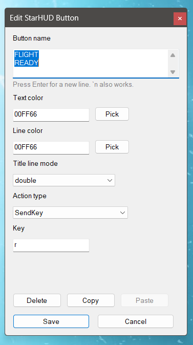

# Configure StarHUD

StarHUD supports both direct file editing in `StarHUD-config*.ahk` files and in-app editing through the HUD.

## Access the config dialogs

### Open the layout editor

1. Press your configured toggle key to show the HUD. The default is `F20`.
2. Press `RAlt` + that same key to toggle layout edit mode.
3. You can also `RAlt` + click the center button to enter layout edit mode with the mouse when the HUD is already open.

### Open the config dialog

While layout edit mode is active, click the center button to open or close the **StarHUD Config** dialog.

### Move buttons

While layout edit mode is active, hold `RAlt` and click a non-center button to select it for moving, then `RAlt` + click another non-center button to swap them. `RAlt` + clicking the center button moves to the next page instead.

### Open the button editor

While layout edit mode is active, click any non-center button to open the **Edit StarHUD Button** dialog for that specific button.

### Leaving edit mode

Edit mode is turned off automatically whenever the HUD is hidden or closed.

## What the config dialog controls

### Config profiles

- **Config file**: chooses which `StarHUD-config*.ahk` profile StarHUD should use. Switching profiles reloads StarHUD into the selected config.
- **New Config**: creates a fresh config profile with the current global settings and a new empty page, then switches to it.
- **Clone Config**: copies the current config profile to a new `StarHUD-config-<name>.ahk` file, then switches to it.
- **Delete Config**: deletes the active config profile after writing a `.bak` backup, then switches to another remaining profile.

### HUD-wide settings

- **Size**: selects one of the built-in size profiles, which control button size, gap, margins, border widths, and insets.
- **Corner radius**: changes how rounded the button corners and panel visuals appear.
- **Mask color**: sets the transparent mask color used for the HUD window.
- **Frame color**: sets the default outer frame color for buttons.
- **Fill color**: sets the default inner fill color used behind button labels and images.
- **Show outer border**: toggles the thin outer frame ring around each button.
- **Open position**: chooses where the HUD opens: at the mouse, auto-split to the nearest side, always-left, or always-right.
- **Toggle key**: sets the bare AutoHotkey key name used to show or hide the HUD. `RAlt` + that same key toggles layout edit mode.
- **Steal mouse input**: when enabled, the HUD captures mouse interaction so the underlying app does not receive clicks or movement while the panel is open.
- **Show key labels on buttons**: shows or hides the action keys that appear under each button title.
- **Open Images**: opens the `images\` folder in Explorer and creates it if needed, so you can manage button images without hunting for the path manually.
- **Live HUD preview**: size, corner radius, outer border, and color changes update the open HUD immediately while the config dialog is open. **Save** keeps them; **Close** restores the original values.

### Page management

- **Add Page**: creates another empty page with the center page-cycle button already in place.
- **Delete Page**: removes the current page after confirmation and writes a `.bak` backup first.
- **Reset Page**: clears the current page back to empty buttons after confirmation and writes a `.bak` backup first.
- **Open File Location**: opens the folder that contains the StarHUD files and config.

## What the button editor controls

- **Button name**: multiline title field for the label shown on the button. The line breaks you type here control how many title lines the button uses.
- **Border color / text color / line color**: per-button colors, with direct hex entry and picker buttons.
- **Border style**: choose whether the button uses a single, double, or no inner border line.
- **Image / Browse / Clear**: shows the selected button image, lets you browse the `images\` folder and its subfolders, or remove the image.
- **Image fit**: controls how the image fills the square button. New image buttons default to `cover`.
- **Show text over image / Show keys over image**: optional overlays that let image buttons keep the button title or sent-key label on top of the image.
- **Live HUD preview**: while the dialog is open, the actual HUD button updates live to reflect your current edits. **Save** keeps the changes; **Cancel** restores the original button.
- **Action type**: choose between `SendKey`, `ChordKey`, `HoldKey`, `DoubleTapKey`, or no action.
- **Action key fields**: define the keys or modifier+key combination used by the selected action. For `ChordKey`, use AutoHotkey modifier names like `LAlt` or `RAlt`.
- **Duration / delay**: shown only for action types that need them.
- **Delete / Copy / Paste**: clear a button, copy a button config, or paste a copied config onto another button.

## Persistence

Changes made through the config dialog and button editor are written back to the active `StarHUD-config*.ahk` file, so the next launch uses the updated layout and settings.

When StarHUD loads or saves an older config file, it silently fills in newer missing settings and refreshes the matching comment blocks so older profiles keep working. Button-image references are kept relative to the `images\` folder whenever possible.

## Visual overview

For a quick view of the HUD itself, see the main overlay screenshot in the [README](../README.md).

